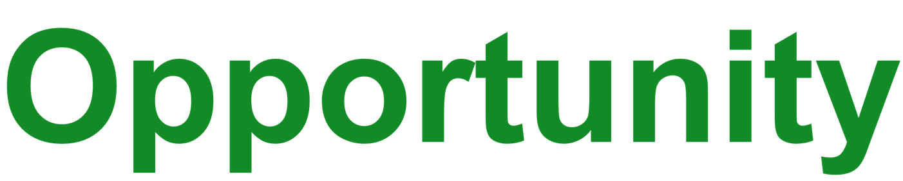

---
layout:
  title:
    visible: false
  description:
    visible: false
  tableOfContents:
    visible: true
  outline:
    visible: true
  pagination:
    visible: true
---

# Opportunity

<figure><figcaption></figcaption></figure>

Gig-work is broken, all the power and relationships are in the hands of large tech companies. You need to have 5 apps open to try and get a full 8 hours a day of work. We simply want to change this situation. &#x20;

Our vision is to create a robust, decentralized ecosystem that empowers drivers, delivery professionals, and businesses to succeed in a new environment characterized by transparency, innovation, and fairness. Rather than these being hollow words, here is how we are going about making this a reality.

1. All our clients / shippers can use our platform for free to manage any drivers they currently employ, and simply use our service for extra deliveries they don’t have the manpower for.
2. Our goal is to give drivers at least 8 hours of well paying work a day; in other words a full-time opportunity. No need to have five different delivery platforms open to try and get enough hours of work in the day.
3. Our delivery platform is totally open source, see for yourself: [https://github.com/OnnexDAO](https://github.com/OnnexDAO). In this way we encourage delivery companies to use our foundational software to build and customize their own businesses, workflows and methodologies.
4. The Onnex platform will supply deliveries and routes to qualified drivers, but it will also allow drivers to set their own pricing and bring their own clients and teams on the platform. They can decide to use the Onnex CoOp as a backup when needed.
5. Drivers will be paid a 1% override on revenue that they bring in from new clients that are transported on the CoOp platform. They earn this as long as they complete a minimum number of deliveries a month and the new client stays on the platform.
6. Clients will be paid a 1% discount (or fee) for any revenue they refer on to the program. They earn this as long as they and the referred client stay in the program, even if they transfer companies but stay in the program.

